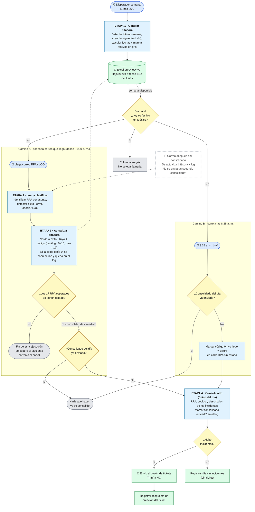

# Flujo general – Automatización bitácora RPA (Sura MX)

> v0.3 · Consolidado inmediato si los 17 RPA ya tienen estado; si no, corte 8:25 a. m. Un 0 se sobrescribe si llega el correo real.

```mermaid
flowchart TD
    classDef disparador fill:#dbeafe,stroke:#1d4ed8,color:#111
    classDef etapa fill:#e0f2fe,stroke:#0369a1,color:#111
    classDef decision fill:#fef9c3,stroke:#a16207,color:#111
    classDef salida fill:#dcfce7,stroke:#15803d,color:#111
    classDef gris fill:#e5e7eb,stroke:#6b7280,color:#111
    classDef nota fill:#fff,stroke:#9ca3af,color:#444,stroke-dasharray:4 3

    T1(["⏰ Disparador semanal<br/>Lunes 0:00"]):::disparador
    E1["<b>ETAPA 1 · Generar bitácora</b><br/>Detectar última semana, crear la siguiente (L–V),<br/>calcular fechas y marcar festivos en gris"]:::etapa
    B1[("📗 Excel en OneDrive<br/>Hoja nueva = fecha ISO del lunes")]:::salida
    T1 --> E1 --> B1

    F{"Día hábil:<br/>¿hoy es festivo<br/>en México?"}:::decision
    FG["Columna en gris<br/>No se evalúa nada"]:::gris
    B1 -. "semana disponible" .-> F
    F -- Sí --> FG

    subgraph PA ["Camino A · por cada correo que llega (desde ~1:30 a. m.)"]
        direction TB
        TE(["📩 Llega correo RPA / LOG"]):::disparador
        E2["<b>ETAPA 2 · Leer y clasificar</b><br/>Identificar RPA por asunto,<br/>detectar éxito / error, asociar LOG"]:::etapa
        E3["<b>ETAPA 3 · Actualizar bitácora</b><br/>Verde = éxito · Rojo + código (catálogo 0–15; otro = 17)<br/>Si la celda tenía 0, se sobrescribe y queda en el log"]:::etapa
        COMP{"¿Los 17 RPA esperados<br/>ya tienen estado?"}:::decision
        ESP(["Fin de esta ejecución<br/>(se espera el siguiente correo o el corte)"]):::gris
        ENVA{"¿Consolidado del día<br/>ya enviado?"}:::decision
        TE --> E2 --> E3 --> COMP
        COMP -- No --> ESP
        COMP -- "Sí · consolidar de inmediato" --> ENVA
    end

    subgraph PB ["Camino B · corte a las 8:25 a. m."]
        direction TB
        TC(["⏰ 8:25 a. m. L–V"]):::disparador
        ENVB{"¿Consolidado del día<br/>ya enviado?"}:::decision
        FALT["Marcar código 0 (No llegó = error)<br/>en cada RPA sin estado"]:::etapa
        TC --> ENVB
        ENVB -- No --> FALT
    end

    F -- No --> TE
    F -- No --> TC
    E3 -.-> B1

    FIN0(["Nada que hacer:<br/>ya se consolidó"]):::gris
    ENVA -- Sí --> FIN0
    ENVB -- Sí --> FIN0

    E4["<b>ETAPA 4 · Consolidado (único del día)</b><br/>RPA, código y descripción de los incidentes<br/>Marca 'consolidado enviado' en el log"]:::etapa
    Q{"¿Hubo<br/>incidentes?"}:::decision
    TK["📧 Envío al buzón de tickets<br/>Ti-Infra MX"]:::salida
    RT["Registrar respuesta de<br/>creación del ticket"]:::salida
    OK["Registrar día sin incidentes<br/>(sin ticket)"]:::salida

    ENVA -- No --> E4
    FALT --> E4
    E4 --> Q
    Q -- Sí --> TK --> RT
    Q -- No --> OK

    TARD["📩 Correo después del consolidado<br/>Se actualiza bitácora + log<br/>No se envía un segundo consolidado*"]:::nota
    TARD -.-> E2
```
